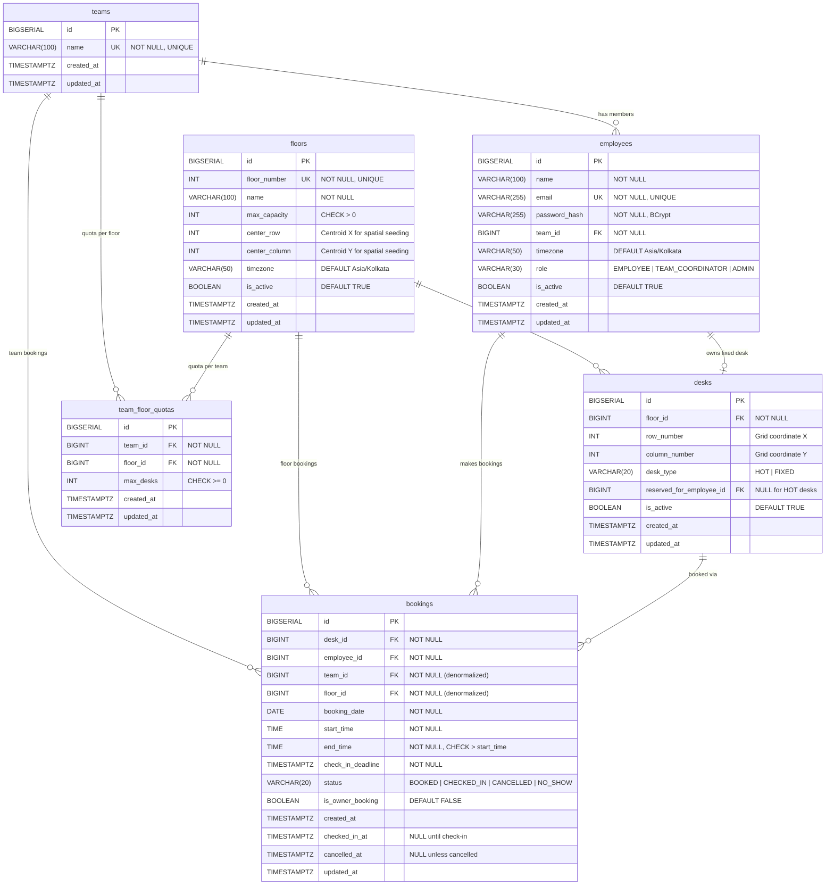

# 🏢 Smart Desk Booking & Team Neighborhood Allocation System

> A high-concurrency Spring Boot application implementing an intelligent spatial desk booking engine, atomic team neighborhood clustering, and robust concurrency control for modern hybrid workplaces.

---

## 📌 Table of Contents
1. [The Problem It Solves](#-the-problem-it-solves)
2. [Key Features](#-key-features)
3. [Technology Stack](#-technology-stack)
4. [Project Architecture](#-project-architecture)
5. [Database Schema (ER Diagram)](#-database-schema-er-diagram)
6. [Quick Start & Setup Guide](#-quick-start--setup-guide)
   - [Prerequisites](#prerequisites)
   - [Configuration Setup](#configuration-setup)
   - [Running the Server](#running-the-server)
   - [Verifying Health](#verifying-health)
7. [How the System Works (Explained Simply)](#-how-the-system-works-explained-simply)
   - [1. Spatial Neighborhood Allocation Algorithm](#1-spatial-neighborhood-allocation-algorithm)
   - [2. Race Condition Prevention & Pessimistic Locking](#2-race-condition-prevention--pessimistic-locking)
   - [3. Multi-Member Team Booking (Anchor-and-Expand)](#3-multi-member-team-booking-anchor-and-expand)
   - [4. Desk Types & Headroom Invariants](#4-desk-types--headroom-invariants)
   - [5. Caching & Fault Tolerance](#5-caching--fault-tolerance)
   - [6. Life-Cycle, No-Shows & Walk-Ins](#6-life-cycle-no-shows--walk-ins)
8. [API Walkthrough & Examples](#-api-walkthrough--examples)
9. [Design Trade-offs & Engineering Decisions](#-design-trade-offs--engineering-decisions)
10. [Project Directory Layout](#-project-directory-layout)

---

## 💡 The Problem It Solves

In hybrid work environments, employees face several daily challenges:
- **Team Fragmentation**: Teammates arrive at the office only to find themselves scattered across different corners or entirely different floors, harming collaboration.
- **Peak-Hour Concurrency & Race Conditions**: When booking opens (e.g., 9:00 AM on Monday), hundreds of employees attempt to claim the best seats simultaneously, leading to double-bookings, database locks, or crashes.
- **Fixed vs. Hot Desk Conflicts**: Dedicated (fixed) desks for specific employees are accidentally given away, or conversely, sit empty when the owner is absent while others need a place to sit.
- **Quota Violations**: Certain teams over-occupy prime floors, leaving no headroom for other departments.

**Smart Desk Booking** solves this by providing:
1. **Intelligent Neighborhood Clustering**: Automatically places you in desks adjacent to your active teammates.
2. **Zero Double-Bookings Guarantee**: Uses a strict hierarchical database lock and partial unique indexes to serialize bookings safely under heavy load.
3. **Atomic Team Reservations**: Allows team coordinators to reserve a compact cluster of adjacent desks for 5–10 members on the same floor in a single transaction (all-or-nothing).
4. **Resilient Architecture**: Built with cloud-native PostgreSQL (Neon) and Redis (Upstash) with graceful degradation if caching nodes fail.

---

## ✨ Key Features

- **Stateless Authentication**: JWT tokens with role-based authorization (`ROLE_EMPLOYEE`, `ROLE_TEAM_COORDINATOR`, `ROLE_ADMIN`) and BCrypt password encryption (strength 12).
- **Intelligent Spatial Recommendation**: Strategy pattern implementing Euclidean distance scoring and centroid-based seeding to seat teammates together.
- **Deterministic Seeding & Tie-Breaking**: No randomness. Equal distance scores are deterministically resolved by desk ID / coordinate order.
- **Multi-Level Concurrency Protection**:
  - Pessimistic parent row locking (`Floor` $\to$ `TeamFloorQuota` $\to$ `Desk`).
  - In-lock fresh spatial ranking to eliminate transaction aborts.
  - PostgreSQL partial unique indexes (`uq_active_desk_day`, `uq_active_employee_day`) as defense-in-depth.
- **Dynamic Headroom & Quota Enforcement**: Ensures that hot desk reservations never eat into reserved seats for fixed desk owners ($\text{hotActive} + \text{fixedNotReleased} \le \text{maxCapacity}$).
- **Fault-Tolerant Cache-Aside**: Redis caches static floor maps and team metadata. If Redis goes offline, the system transparently falls back to direct database queries without user-facing 500 errors.
- **Automated No-Show Release**: Timezone-safe background task running in India Standard Time (`Asia/Kolkata`) that reclaims unattended desks for same-day walk-ins.
- **RFC 7807 Compliant Errors**: Standardized JSON Problem Details for clean, predictable client-side error handling.

---

## 🛠 Technology Stack

| Layer | Technology | Details |
|---|---|---|
| **Language & Runtime** | Java 21 / 25 | Modern Java syntax, records, and streams |
| **Framework** | Spring Boot 3.x / 4.x | Web MVC, Security, Data JPA, Cache, Actuator |
| **Primary Database** | PostgreSQL (Neon Cloud) | ACID transactions, pessimistic locks, partial indexes |
| **Database Migrations** | Flyway | Automated, version-controlled schema evolution |
| **Cache Layer** | Redis (Upstash Cloud) | Lettuce client over TLS/SSL (`rediss://`) |
| **Security** | Spring Security + JJWT | Stateless JWT bearer tokens, BCrypt (strength 12) |
| **Build Tool** | Apache Maven | Included Maven Wrapper (`mvnw` / `mvnw.cmd`) |
| **Observability** | Spring Boot Actuator + Micrometer | Health, info, and domain metrics |

---

## 🏛 Project Architecture

The application follows an enterprise-grade **modular layered architecture**:

```
com.anurag.smartdesk
├── config/              # Security, JWT filter, Redis fault tolerance, Actuator
├── controller/          # REST API Controllers (input validation, response DTOs)
├── dto/
│   ├── request/         # Incoming request contracts (@Valid, @NotBlank)
│   └── response/        # Outgoing API responses & RFC 7807 problem details
├── exception/           # Custom domain exceptions & @RestControllerAdvice
├── model/               # JPA entities (Floor, Desk, Team, Employee, Booking)
├── repository/          # Spring Data JPA repositories with pessimistic locks
├── service/             # Business logic interfaces & implementations
│   └── impl/
├── strategy/            # Desk recommendation algorithms (Strategy pattern)
│   └── impl/
└── util/                # Coordinate math, time/clock abstractions
```

---

## 🗃️ Database Schema (ER Diagram)

The system uses **6 core tables** in PostgreSQL, connected by foreign key relationships. Flyway manages the schema via [`V1__init_schema.sql`](file:///d:/projects/smart-desk-booking/smart-desk-booking/src/main/resources/db/migration/V1__init_schema.sql).



### Key Database Constraints & Indexes

| Constraint / Index | Type | Purpose |
|---|---|---|
| `uq_active_desk_day` | Partial Unique Index | Prevents double-booking: only one active booking per desk per day |
| `uq_active_employee_day` | Partial Unique Index | One active booking per employee per calendar day |
| `idx_bookings_team_quota` | Partial Composite Index | Fast team quota enforcement scans (hot bookings only) |
| `idx_bookings_floor_capacity` | Partial Composite Index | Fast floor headroom checks (hot bookings only) |
| `idx_bookings_noshow_sweep` | Partial Index | Efficient no-show auto-release background sweeps |
| `chk_desk_fixed_owner` | Check Constraint | FIXED desks must have an owner; HOT desks must not |
| `uq_floor_row_col` | Unique Constraint | No two desks share the same grid position on a floor |

---

## 🚀 Quick Start & Setup Guide

### Prerequisites
1. **Java Development Kit (JDK)**: JDK 17 or higher installed (JDK 21 or 25 recommended).
   ```bash
   java -version
   ```
2. **Git**: Installed and configured.

---

### Configuration Setup

The project uses a two-tier configuration structure:
1. `src/main/resources/application.properties`: Standard configuration template with environment variable fallbacks.
2. `src/main/resources/application-local.properties`: **Your local secret file (ignored by Git)** containing real credentials.

#### 1. Verify `application-local.properties`
Check that `smart-desk-booking/src/main/resources/application-local.properties` exists with your database and cache credentials:

```properties
# ===================================================================
# Local Development Profile - Overrides application.properties
# (This file is kept out of Git to protect secrets)
# ===================================================================

# Neon PostgreSQL Connection
spring.datasource.url=jdbc:postgresql://<neon-host>/neondb?sslmode=require&channel_binding=require
spring.datasource.username=<neon-username>
spring.datasource.password=<neon-password>

# Upstash Redis Connection (TLS/SSL Enabled)
spring.data.redis.url=rediss://default:<upstash-token>@<upstash-host>:6379
spring.data.redis.host=<upstash-host>
spring.data.redis.port=6379
spring.data.redis.username=default
spring.data.redis.password=<upstash-token>
spring.data.redis.ssl.enabled=true

# JWT Signing Secret (minimum 32 characters for HMAC-SHA256)
jwt.secret=SmartDeskBookingSecretKey2026MustBeAtLeast32Characters
```

---

### Running the Server

Open your terminal, navigate to the `smart-desk-booking` directory, and run the Maven wrapper:

#### On Windows (PowerShell / Command Prompt):
```powershell
cd d:\projects\smart-desk-booking\smart-desk-booking
.\mvnw.cmd spring-boot:run
```

#### On macOS / Linux:
```bash
cd smart-desk-booking
./mvnw spring-boot:run
```

#### What happens during boot:
1. **Flyway Migration**: Automatically connects to PostgreSQL and applies `V1__init_schema.sql` (creating `floors`, `desks`, `teams`, `employees`, `bookings`, `team_floor_quotas`, and indexes).
2. **Hibernate Validation**: Checks that all JPA entities strictly match the database schema.
3. **Redis Verification**: Wires the connection to Upstash Redis over TLS.
4. **Tomcat Server**: Starts on **port `8080`**.

---

### Verifying Health

In a new terminal window, test the Actuator health endpoint:

```powershell
# Windows PowerShell
Invoke-RestMethod -Uri http://localhost:8080/actuator/health
```

```bash
# macOS / Linux (curl)
curl -s http://localhost:8080/actuator/health
```

**Expected Response:**
```json
{
  "status": "UP",
  "groups": ["liveness", "readiness"]
}
```

---

## 🧠 How the System Works (Explained Simply)

### 1. Spatial Neighborhood Allocation Algorithm
When an employee books a hot desk, the system uses the **Strategy Pattern** to decide which desk to assign:

- **Case A: Teammates already have bookings on this floor today**
  - Uses `TeamNeighbourhoodStrategy`.
  - Calculates the **centroid** (average $X, Y$ coordinate) of all active teammates.
  - Scores eligible free desks by their proximity to the nearest teammate and the centroid using **Squared Euclidean Distance**:
    $$\text{Distance}^2 = (x_{\text{candidate}} - x_{\text{teammate}})^2 + (y_{\text{candidate}} - y_{\text{teammate}})^2$$
    *(We skip `Math.sqrt` because distance ordering remains identical without expensive floating-point square root calculations).*
- **Case B: No teammates are booked on this floor yet**
  - Uses `CenterBasedStrategy`.
  - Finds the geometric center of the floor layout and seats the first member closest to the center, applying a slight density penalty to avoid crowded corners.
- **Deterministic Tie-Breaking**:
  If two desks have identical scores, the desk with the smaller ID (`desk.id ASC`) is chosen. There is **zero randomness**, ensuring fully reproducible results.

---

### 2. Race Condition Prevention & Pessimistic Locking
In high-concurrency environments, naive desk booking causes race conditions where two threads try to book the last seat at the same time.

```
Incoming Request
      │
      ▼
Acquire Pessimistic Lock on Parent Floor (SELECT ... FOR UPDATE)
      │
      ▼
Acquire Pessimistic Lock on TeamFloorQuota (SELECT ... FOR UPDATE)
      │
      ▼
Execute In-Lock Fresh Spatial Ranking (checks real-time DB state)
      │
      ▼
Acquire Lock on Chosen Desk & Insert Booking
      │
      ▼
Commit Transaction & Release Locks
```

1. **Parent Row Serialization**: Because floor capacity and team quotas are aggregate numbers across multiple rows, row-level locks on individual desks cannot protect them. Transactions lock the parent `Floor` and `TeamFloorQuota` rows first.
2. **In-Lock Fresh Spatial Ranking**: In PostgreSQL, a failed constraint aborts the entire transaction. By locking the parent floor row, competing threads wait in line. When Thread B gets its turn, it evaluates available desks against the fresh database state, picks the next closest desk, and commits cleanly without throwing errors or retrying.
3. **Database-Level Defense-in-Depth**:
   - `uq_active_desk_day`: Unique index on `(desk_id, booking_date)` where `status IN ('BOOKED', 'CHECKED_IN')`.
   - `uq_active_employee_day`: Unique index on `(employee_id, booking_date)` where `status IN ('BOOKED', 'CHECKED_IN')`.

---

### 3. Multi-Member Team Booking (Anchor-and-Expand)
- **Role Requirement**: Only users with `ROLE_TEAM_COORDINATOR` can trigger this endpoint (`/api/bookings/team`).
- **All-or-Nothing Guarantee**: Either every requested team member gets a desk on the same floor, or the entire transaction rolls back.
- **How it works**:
  1. The first teammate is placed near the existing team cluster or floor center ("the anchor").
  2. Each subsequent member is placed adjacent to the expanding team cluster.
  3. All bookings are committed together inside an atomic `@Transactional` boundary.

---

### 4. Desk Types & Headroom Invariants
- **Hot Desks**: Shared flexible desks bookable by any employee subject to quotas.
- **Fixed Desks**: Dedicated to a specific employee.
- **The Seat Guarantee Invariant**:
  $$\text{hotActive} + \text{fixedNotReleased} \le \text{maxCapacity}$$
  Where $\text{fixedNotReleased} = \text{totalFixedDesksOnFloor} - \text{fixedReleasedToday}$.
  Even if a fixed-desk owner hasn't booked yet, their seat's headroom is strictly protected from being taken by hot bookings. A fixed desk only enters the hot pool if the owner explicitly cancels or fails to show up by the check-in deadline.

---

### 5. Caching & Fault Tolerance
- **The Golden Rule**: Redis speeds up reads; PostgreSQL is the single source of truth for all bookings, quotas, and locks.
- **What is cached**: Static floor plans, desk physical coordinates (`row, col`), and team metadata (TTL: 30–60 minutes).
- **What is NEVER cached**: Real-time availability, remaining quota, or booking status.
- **Fault-Tolerant Cache Handler**: [FaultTolerantCacheConfig.java](file:///d:/projects/smart-desk-booking/smart-desk-booking/src/main/java/com/anurag/smartdesk/config/FaultTolerantCacheConfig.java) ensures that if Redis goes down, warnings are logged and requests fall back to direct PostgreSQL queries transparently.

---

### 6. Life-Cycle, No-Shows & Walk-Ins
1. **Status Flow**: `AVAILABLE` $\longrightarrow$ `BOOKED` $\longrightarrow$ `CHECKED_IN`.
2. **Cancellations**: Allowed anytime before the check-in deadline (`requestTime < checkInDeadline`). Cancelled desks immediately return to the available pool.
3. **No-Show Reclaim**: A scheduled background job runs atomic, idempotent SQL:
   ```sql
   UPDATE bookings 
   SET status = 'NO_SHOW', updated_at = :nowUtc 
   WHERE status = 'BOOKED' AND check_in_deadline <= :nowUtc;
   ```
4. **Walk-Ins**: Desks freed by cancellations or no-show sweeps can be booked immediately by walk-ins, with dynamically computed check-in deadlines (`now + 15 min grace`) to prevent instant expiration.

---

## 📡 API Walkthrough & Examples

### 1. Register a New User
```bash
POST /api/auth/register
Content-Type: application/json

{
  "name": "Anurag Basuri",
  "email": "anurag@company.com",
  "password": "password123",
  "teamName": "Engineering"
}
```

### 2. Login to Receive JWT Token
```bash
POST /api/auth/login
Content-Type: application/json

{
  "email": "anurag@company.com",
  "password": "password123"
}
```
**Response:**
```json
{
  "success": true,
  "message": "Login successful",
  "data": {
    "token": "eyJhbGciOiJIUzM4NCJ9...",
    "employeeId": 1,
    "name": "Anurag Basuri",
    "email": "anurag@company.com",
    "role": "EMPLOYEE",
    "teamName": "Engineering"
  }
}
```

### 3. Book a Hot Desk (Individual)
```bash
POST /api/bookings
Authorization: Bearer <YOUR_JWT_TOKEN>
Content-Type: application/json

{
  "floorId": 1,
  "bookingDate": "2026-09-25"
}
```

### 4. Book Desks for a Team (Coordinator Only)
```bash
POST /api/bookings/team
Authorization: Bearer <COORDINATOR_JWT_TOKEN>
Content-Type: application/json

{
  "floorId": 1,
  "bookingDate": "2026-09-25",
  "employeeIds": [2, 3, 4]
}
```

### 5. Check In to a Desk
```bash
POST /api/bookings/{bookingId}/check-in
Authorization: Bearer <YOUR_JWT_TOKEN>
```

### 6. Cancel a Booking
```bash
POST /api/bookings/{bookingId}/cancel
Authorization: Bearer <YOUR_JWT_TOKEN>
```

### 7. Get My Booking History
```bash
GET /api/bookings/history
Authorization: Bearer <YOUR_JWT_TOKEN>
```

---

## ⚖️ Design Trade-offs & Engineering Decisions

| Dilemma | Chosen Approach | Rationale / Trade-off |
|---|---|---|
| **Pessimistic vs. Optimistic Locking** | **Pessimistic Locking** | Under high peak-morning contention, optimistic locking causes mass rollbacks and retry storms. Pessimistic locking cleanly serializes requests at the parent floor row. |
| **Distance Calculation** | **Squared Euclidean Distance** | Calculating $\Delta x^2 + \Delta y^2$ in memory avoids floating-point `Math.sqrt` overhead while producing the exact same spatial ranking in sub-2ms. |
| **Spatial Indexing** | **In-Memory Scoring** | At typical floor scale (50–500 desks), in-memory distance calculations take microseconds. Heavy GIS engines (PostGIS) add unnecessary operational overhead. |
| **Time Granularity** | **Workday Slots (IST)** | Office desks are booked for business days (09:00–18:00 IST). Day-level slotting avoids time interval fragmentation while satisfying all workplace requirements. |
| **Cache Invalidation** | **Cache Metadata, Not State** | Cache desk coordinates and floor plans, but read real-time availability and quotas directly from PostgreSQL under lock. This eliminates cache synchronization bugs. |

---

## 📂 Project Directory Layout

```
smart-desk-booking/
├── pom.xml                               # Project dependencies & build plugins
├── src/
│   ├── main/
│   │   ├── java/com/anurag/smartdesk/
│   │   │   ├── SmartDeskBookingApplication.java
│   │   │   ├── config/                   # Security, JWT, Redis, Cache
│   │   │   ├── controller/               # Auth, Booking, Desk, Floor, Team
│   │   │   ├── dto/                      # Request & Response models
│   │   │   ├── exception/                # Problem Details & Global Handler
│   │   │   ├── model/                    # JPA Entities & Enums
│   │   │   ├── repository/               # Repositories with Pessimistic Locks
│   │   │   ├── service/                  # Service interfaces & implementations
│   │   │   ├── strategy/                 # Spatial allocation algorithms
│   │   │   └── util/                     # Math & Clock helpers
│   │   └── resources/
│   │       ├── application.properties    # Base template (env vars)
│   │       ├── application-local.properties # Local credentials (gitignored)
│   │       └── db/migration/
│   │           └── V1__init_schema.sql   # Flyway database schema & indexes
│   └── test/                             # Unit and integration tests
```

---

## 👨‍💻 Author & Evaluation Note

Developed by **Anurag Basuri** for the **Smart Desk Booking & Team Neighborhood Allocation System** Case Study. Designed to meet all evaluation criteria including algorithmic complexity ($O(C \log M)$), race condition prevention, fault tolerance, and clean object-oriented architecture.
